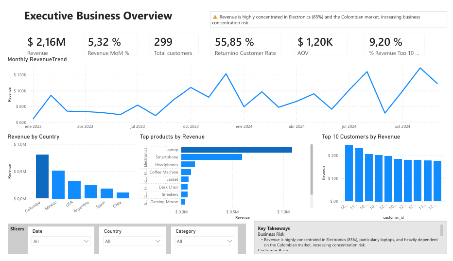
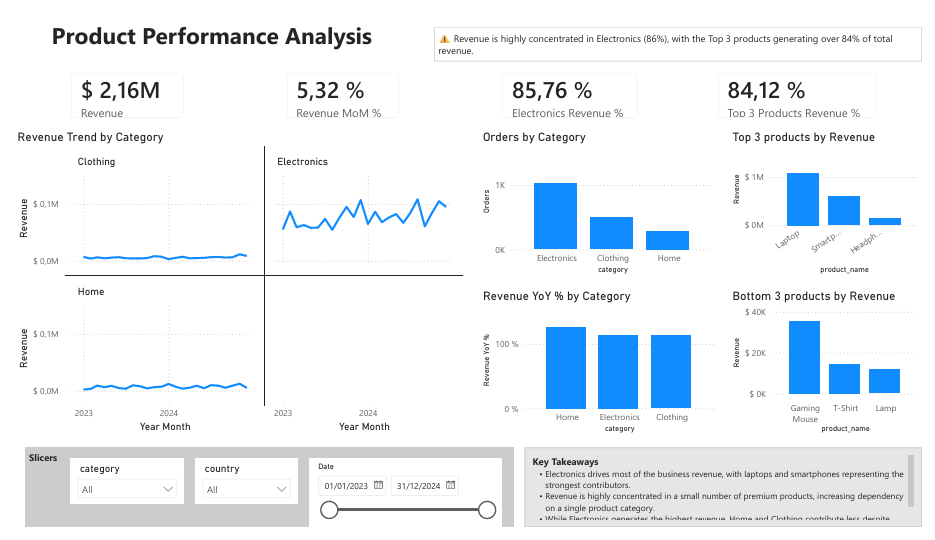
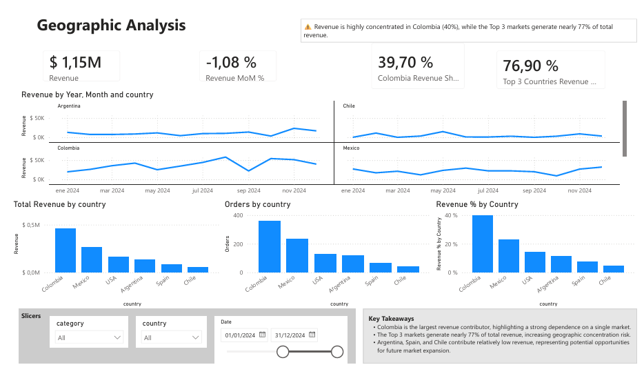
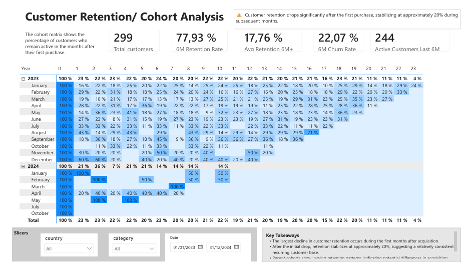
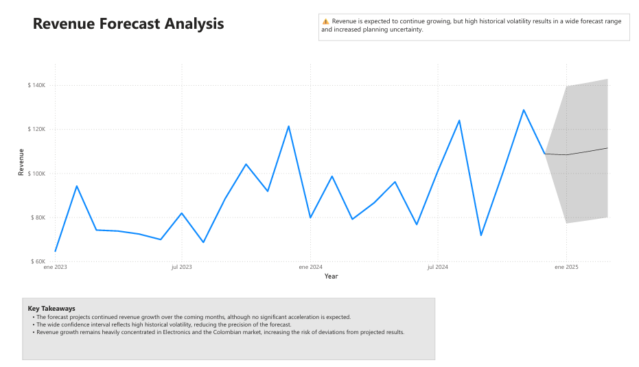

# E-commerce Business Intelligence Solution

## 📖 Project Overview

This project presents a complete **Business Intelligence solution** developed for a fictional e-commerce company.

The objective is to transform transactional data into actionable insights through interactive dashboards that support executive decision-making.

The solution answers five strategic business questions covering executive performance, product performance, geographic performance, customer retention, and revenue forecasting.

---

# 🎯 Business Questions Addressed

1. Is the business growing in a healthy and sustainable way?
2. Which products and categories are driving business performance?
3. Which markets are driving business growth, and where are the greatest concentration risks?
4. Are we successfully retaining customers over time?
5. Based on historical trends, how is revenue expected to evolve?

---

# 🗂 Dataset

Synthetic e-commerce dataset created for Business Intelligence and analytics practice.

The dataset includes:

- Sales Transactions
- Customers
- Products
- Categories
- Countries
- Dates

---

# 🛠 Tools Used

- Power BI
- Power Query
- DAX

---

# 📊 Executive Business Overview

### Business Question

**Is the business growing in a healthy and sustainable way, and what factors are driving or limiting that growth?**

### Key Insights

- Revenue is highly concentrated in the Electronics category (≈85%), with laptops representing the largest contributor.
- Colombia generates the highest share of revenue, indicating strong dependence on a single market.
- Approximately 56% of customers are returning customers, suggesting a relatively loyal customer base.
- The Top 10 customers represent only 9% of total revenue, indicating low dependency on individual customers.

### Business Recommendations

- Diversify revenue across additional product categories.
- Expand commercial presence beyond the Colombian market.
- Continue strengthening customer retention initiatives while increasing customer acquisition.
- Monitor product and geographic concentration to reduce long-term business risk.

---

# 📦 Product Performance Analysis

### Business Question

**Which products and categories are driving business performance, and which represent opportunities or risks for future growth?**

### Key Insights

- Electronics drives most of the business revenue, with laptops and smartphones representing the strongest contributors.
- Revenue is highly concentrated in a small number of premium products, increasing dependency on a single product category.
- Home and Clothing contribute less revenue despite representing a meaningful share of total orders.

### Business Recommendations

- Diversify the product portfolio to reduce dependency on premium products.
- Promote underperforming categories through pricing and marketing initiatives.
- Monitor product concentration as part of executive business reviews.
- Balance revenue growth with category diversification strategies.

---

# 🌎 Geographic Analysis

### Business Question

**Which markets are driving business growth, and where are the greatest opportunities or concentration risks?**

### Key Insights

- Colombia is the largest revenue contributor, highlighting strong dependence on a single market.
- The Top 3 markets generate nearly 77% of total revenue, increasing geographic concentration risk.
- Argentina, Spain, and Chile represent potential opportunities for future expansion.

### Business Recommendations

- Diversify revenue across additional geographic markets.
- Strengthen commercial strategies in underperforming countries.
- Monitor regional concentration as part of business planning.
- Evaluate market expansion opportunities based on sales performance.

---

# 👥 Customer Retention & Cohort Analysis

### Business Question

**Are we successfully retaining customers over time, or are we losing them shortly after their first purchase?**

### Key Insights

- The largest decline in customer retention occurs during the first months after acquisition.
- After the initial drop, retention stabilizes at approximately 20%.
- Recent cohorts show varying retention patterns, suggesting differences in acquisition quality or customer engagement.

### Business Recommendations

- Strengthen onboarding and engagement initiatives during the first months after acquisition.
- Analyze high-performing cohorts to replicate successful acquisition strategies.
- Develop loyalty initiatives to increase repeat purchases.
- Continuously monitor cohort performance to evaluate retention initiatives.

---

# 📈 Revenue Forecast Analysis

### Business Question

**Based on historical trends, how is revenue expected to evolve, and how reliable are those projections for business planning?**

### Key Insights

- Revenue is expected to continue growing, although no significant acceleration is projected.
- High historical volatility creates a wide confidence interval, reducing forecast precision.
- Revenue growth remains highly concentrated in Electronics and the Colombian market.

### Business Recommendations

- Use the forecast as a planning guide rather than an exact prediction.
- Reduce revenue concentration across products and markets.
- Compare actual performance against forecasts to identify deviations early.
- Reassess forecasting models as new business data becomes available.

---

# 👤 Author

**Ana Milena Gonzalez**

Project & Business Analytics

Power BI • SQL • Data Analysis • Operations & Reporting
